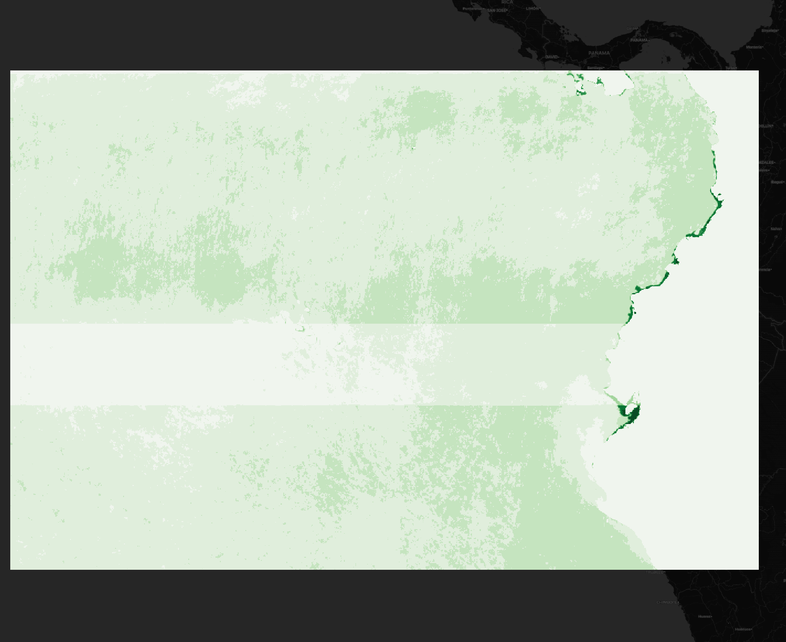
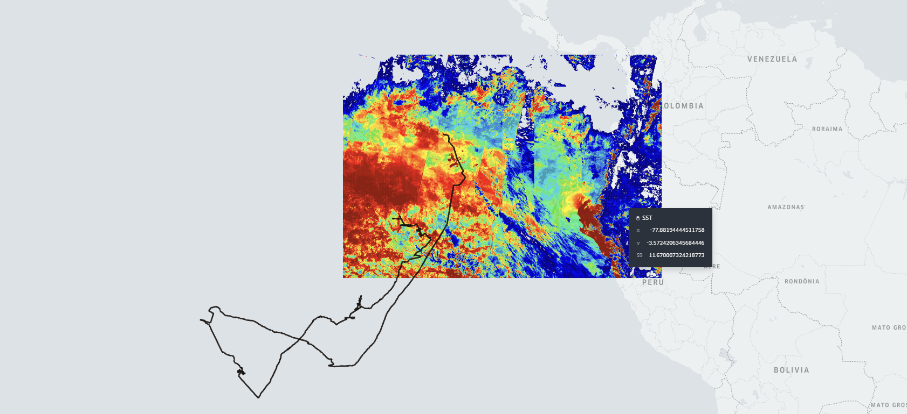

# OpenEO User-consultation final report

### ***[“Wildlife Tracker for Oceans”](https://www.gis4-wildlife.com/) A geo-framework for real-time management of Marine Protected Areas***

## ***Content***
- **openEO-sentinel3-SLSTR.ipynb** notebook to fetch Sentinel3 SLSTR data for Galapagos Islands region 
- **openEO-sentinel3-OLCI.ipynb** notebook to fetch Sentinel3 OLCI data for Galapagos Islands region 
- **Sentinel3-tif-OLCI.qgz** QGIS project connected to visualize results of OLCI sensor

## ***Results***
- **sst.nc** NetCDF obtained from openEO and Sentinel3 SLSTR
- **download.Oa10_radiancev.tif** TIF downloaded from openEO and Sentinel3 OLCI
- **sst_gps_S9.png** Map of downloded SST
- **chl_gps_b10.png** Map of downloded Chl-a

### More information about [Sky the whale shark](https://www.gis4-wildlife.com/galapagos-whale-shark-project)

